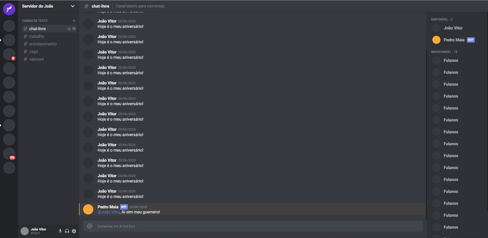

  

  
  
  

  

  Este é um projeto desenvolvido para prática de Typescript junto de Styled Components.

## Executando

- Rode `cd` para acessar a pasta no seu diretório;
- Rode `npm init -y` para iniciar o package.json;
- Rode `npm install -y` para instalar as dependências;
- Rode `npm start` para executar a aplicação;
